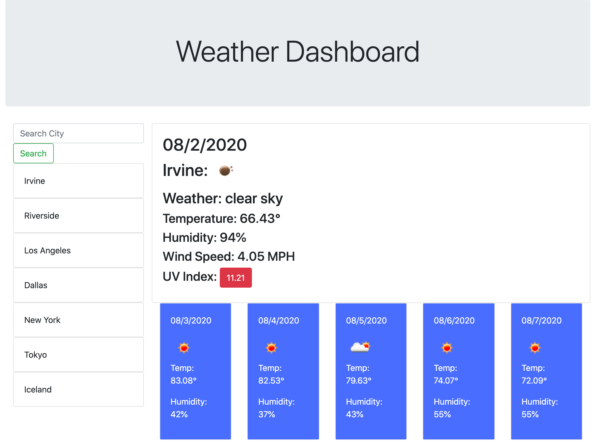
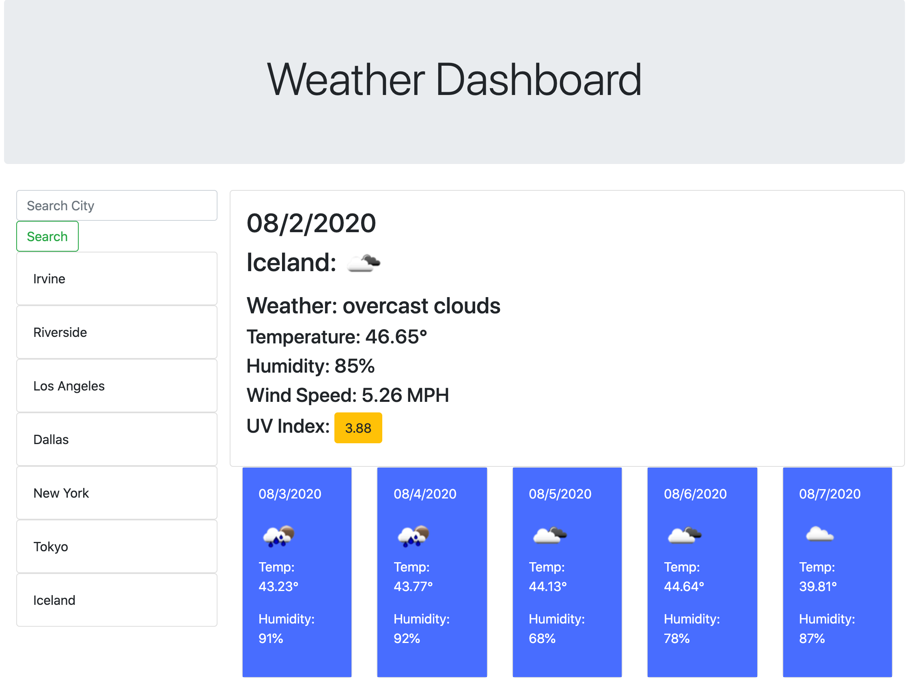

# weather-dashboard

This is an intuitive web application that allows the user to search for any city and view its current weather along with its 5-day forecast.  Then it displays all the recent searches in a list below the search bar!

Using vanilla javascript DOM manipulation and the OpenWeather API, I wrote two main functions to dynamically update the HTML.  In the getWeather function, we pass a parameter that is the name of the city.  With this function we exeute our API requests using the axios.get function.  I used the first API request to get the current weather data, and within that API requested i nested another API request to get the UV index.  I did this, because I needed to grab the longitude and latitude from the first request and put that in the URL for the second request. The third request was to get the 5-day forecast information.

After we get this information we dynamilly update the html to present all the data in a user friendly format that is also asthetically pleasing and easy to understand.

Every time the search button is clicked we also execute the storyCity function which will then store that city name in the local storage and display it in the list below.

If a user clicks one of the previously searched cities, we run the getWeather function again and display the information for that city.

**Here is one screenshot of the application displaying the weather for Irvine:**

**Here we can see that in another city with a moderate UV index, the color changes to reflect a modereate value:**

My application is deployed here: https://devincastro.github.io/weather-dashboard/
